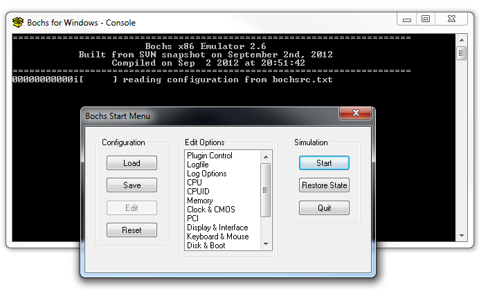

# Bochspwn documentation

**Authors**: Mateusz Jurczyk and Gynvael Coldwind, Google Security Team

**Date**: July 26, 2013

**Important note**: The following documentation was written when Bochspwn was originally published in 2013, and may be out of date with regards to the current state of the code (which was last updated in 2017). However, it is still mostly accurate and provides general guidance on how to build and use the toolset. For a list of specific differences in the way it should be compiled and used nowadays, see [Building and usage](README.md#building-and-usage) in [README.md](README.md).

## Introduction

The Bochspwn project is designed to perform advanced logging of memory references performed by operating system kernels and examine the resulting logs in search of specific patterns indicating presence of software bugs, often of security nature. Information about memory references is obtained by running a guest operating system of choice using the latest version of the [Bochs IA-32 Emulator](http://bochs.sourceforge.net/) with a custom instrumentation component. The only currently supported pattern is characteristic to a double-fetch situation, depicted by two Windows-specific C code snippets below:

```C++
PDWORD BufferSize = controlled user-mode address;
PBYTE BufferPtr = controlled user-mode address;
PBYTE LocalBuffer;

LocalBuffer = ExAllocatePool(PagedPool, *BufferSize); // <--- READ #1
if (LocalBuffer != NULL) {
  RtlCopyMemory(LocalBuffer, BufferPtr, *BufferSize); // <--- READ #2
} else {
  // bail out
}
```
_Listing 1. An example of a double fetch vulnerability in the processing an input user-mode buffer_

```C++
PSTRUCTURE OutputPtr = controlled user-mode address;
DWORD OutputValue = 1337;

try {
  ProbeForWrite(OutputPtr->Address, sizeof(PDWORD), 1);            // <--- READ #1
  RtlCopyMemory(OutputPtr->Address, &OutputValue, sizeof(DWORD));  // <--- READ #2
} except (...) {
  // bail out
}

```
_Listing 2. An example of a double fetch vulnerability in passing output data to user-mode_


As user-mode regions of the virtual address space are shared between the ring-3 and ring-0 privilege levels (in most commonly used operating systems) in that they can be accessed by code running in both modes of execution at the same time, the processing of user-accessible memory within kernel drivers should be carried out with extreme care. In particular, each unique portion of data provided by user-land software should only be fetched once and saved in kernel mode memory for further processing, if required. Otherwise, assuming the consistency of user controlled memory between multiple data fetches might open up room for potential race conditions between the vulnerable kernel routines and ring-3 threads, with the possible outcome of allowing a security breach in the system or disclosing sensitive information stored in kernel memory.

In the first code snippet, a value denoting the expected buffer size is fetched from user-mode twice: once during memory allocation and once while specifying the number of bytes to copy to the new buffer. Getting the program variable to change in between the two memory reads (e.g. by running a concurrent thread flipping bits in the value in question) could cause the kernel to write data past the allocated buffer boundary and therefore trigger a typical kernel pool-based buffer overflow condition. The second example is fairly similar: the affected code allows potential inconsistency between the pointers being validated and actually used, creating room for a write-what-where condition as a result of a classic [time-of-check-to-time-of-use problem](https://en.wikipedia.org/wiki/Time_of_check_to_time_of_use). Although the two examples are technically trivial and easy to spot during manual analysis, most kernel code is much more complex and less obvious, often leading to double-fetch situations which are almost impossible to identify in a non-automated way. By logging and filtering references to user-mode memory performed within the kernel, Bochspwn tries to facilitate this process, extracting particularly suspicious patterns and presenting them to the user for further, manual investigation.

**Note:** This document does not address the exploitation process for kernel race condition vulnerabilities. Only Bochspwn related technicalities and project usage information is included in the documentation, aimed to help users and vendors locate and fix security issues in their products. For detailed information regarding offensive aspects of kernel race conditions and how they can be taken advantage of, please check other available resources [[1](https://j00ru.vexillium.org/slides/2013/syscan.pdf), [2](https://j00ru.vexillium.org/papers/2013/bochspwn.pdf), [3](https://j00ru.vexillium.org/2013/06/kernel-double-fetch-race-condition-exploitation-on-x86-further-thoughts/), [4](https://events.ccc.de/congress/2007/Fahrplan/attachments/1024_Ring-Zero-to-UID-Zero)].

## Overall design

The Bochspwn project is currently divided into four major components:

- Instrumentation - core of the project, plugged into a custom Bochs build, responsible for monitoring and logging detailed information about references to user-mode memory performed by all kernel-mode components (i.e. system call handlers, interrupt handlers, IOCTL routines and other code). Depending on the configuration, it is possible to either have the complete logs saved to local storage, or processed at run time.

The next three stages are only necessary in the offline mode:

- Separation - splitting a single, large log file into smaller units that can be analyzed independently. In practice, this resolves to creating a separate log file for each unique thread in the system; depending on the guest operating system, threads are uniquely characterized by a combination of the {process id, thread id, thread creation time} properties.
- Filtering - iterating through the log files in search of patterns characteristic to certain programming errors, such as double fetches. The output of filtering tools are files nearly ready for manual analysis by a human to sort out the false positives and identify actual bugs.
- Post-processing - transforming the "filtering" stage output into human-readable form, i.e. symbolizing stack traces and so forth.

The process of building and using each particular part of the tool chain is described in their corresponding sections below.

## Supported guest platforms

The currently supported platforms confirmed to work within our testing environment are:

- Microsoft Windows 7
  - SP0 x86
  - SP1 x86
  - SP1 x86-64
- Microsoft Windows 8 x86 and x86-64
- Microsoft Windows 8.1 x86
- Ubuntu Server 13.10 x86 and x86-64
- FreeBSD 9.1 x86 and x86-64
- OpenBSD 5.3 x86-64 (work in progress)

Further development is planned for:

- NetBSD
- Mac OS X

## Project considerations

Similarly to other dynamic automated software security testing techniques such as simple mutation-based fuzzing, the effectiveness of Bochspwn is limited to the kernel code coverage achieved while running the instrumented operating system. Since it is a passive method and operates solely on actual memory access history, it is only capable of finding issues that are  physically triggered at some point of OS activity. As such, the approach is far less effective compared to comprehensive static analysis; however, no suitable static analysis tools able to perform examination of this complexity level are known to the authors. Given the high degree of reliance on code coverage, we have been able to come up with several simple tricks to perform within the guest, which would significantly improve the final results quality:

Generic:
- Run a video game to trigger code paths in graphics-related drivers and interfaces (e.g. Direct X on Windows).
- Play an audio track to trigger audio-related interfaces.
- Play a video track for a similar purpose.
- Browse the internet to involve the tcp/ip stack and networking interfaces.
- Run publicly available system call fuzzers.

Microsoft Windows:
- Run [winetests](https://wiki.winehq.org/ConformanceTests).

Linux:
- Run the [trinity](http://codemonkey.org.uk/projects/trinity/) system call fuzzer.
- Run the [iknowthis](https://code.google.com/archive/p/iknowthis/) system call fuzzer.
- Run the [Linux Test Project](https://github.com/linux-test-project/ltp) unit tests.
- Run the [fsfuzzer](https://www.ee.oulu.fi/research/ouspg/fsfuzzer) file system fuzzer.

FreeBSD:
- Run the [regression tests](https://svnweb.freebsd.org/base/head/tools/regression/).
- Run the [stress2 tests](https://people.freebsd.org/~pho/stress/index.html).
- Run the [lf6 and netusse](https://code.google.com/archive/p/netusse/) fuzzers.
- Run the *trinity* and *fsfuzzer* fuzzer ports

All ideas regarding practical ways to further improve the coverage of kernel code in any of the above platforms are more than welcome.

## Known problems

- Sometimes stack traces are incomplete or invalid - they may contain completely bogus entries, lack items at the beginning or in the middle of the call stack or reveal other anomaly. The behavior is primarily caused by various build-time optimizations performed by kernel compilers, such as function inlining, re-using the stack frame pointer register for non-typical purposes, or omitting the frame pointers. While infrequent, such situations may happen, so you should never fully trust the report stack trace before it is manually confirmed.
- No stack traces are available on 64-bit versions of Windows due to the architectural changes applied to the stack layout - in short, the chain of recursive calls can no longer be recovered by examining successive stack frame pointers, as there are no stack frame pointers anymore.
- Sometimes (very rarely) the instruction address in the call stack points to one instruction prior to the one performing an actual memory reference.
- Output of the `doubleread.cc` utility for Windows tends to be dominated with false positive `CI.dll` related log entries. This problem can be resolved by filtering them out using the `nocidll.cc` utility included in Bochspwn.

## Instrumentation

This section contains a brief crash course on building and running instrumented Bochs. We have chosen to discuss the set up which worked best for us (cross-compiling Bochs for Windows on Linux). Both the emulator and the instrumentation module are cross-system compatible and thus should be possible to compile and run in any configuration of software platforms. The configuration and steps explained below are known to work and can be used for reference, but feel free to experiment with different options on your own.

### Dependencies

We will be building a 32-bit PE executable using a 32-bit MinGW cross-compiler on Linux. For instrumentation projects where more than 2GB of memory is required to function correctly, it is similarly straightforward to build a 64-bit Bochs executable: just follow the steps below using `gcc-mingw-w64` instead of `gcc-mingw32` and `x86_64-w64-mingw32` instead of `i586-mingw32msvc`. Bochs is easiest to run on Windows, but to compile on Linux (otherwise, you are facing the perspective of setting up a specific unix-like environment on a Windows host, which can be a very frustrating experience). The only strict dependency of Bochspwn are [Protocol Buffers](https://github.com/google/protobuf) (protobufs) as provided by Google, with the optional addition of DbgHelp (in the form of `DbgHelp.h` and either `dbghelp.lib` or `dbghelp.dll`). Since we are cross-compiling the Bochs project using a Linux host to build the application for a Windows target, we must obtain the MinGW GCC tool chain first:

`$ sudo apt-get install gcc-mingw32`

Once the compiler successfully installs, we should be able to verify that it works:

```
$ i586-mingw32msvc-gcc --version
i586-mingw32msvc-gcc (GCC) 4.4.2
Copyright (C) 2009 Free Software Foundation, Inc.
This is free software; see the source for copying conditions. There is NO
warranty; not even for MERCHANTABILITY or FITNESS FOR A PARTICULAR PURPOSE.
```

Further on, we need to compile and install protobufs in our mingw environment. In order to do so, you need to download `protobuf-2.5.0.tar.bz2` (or the latest available version) from http://code.google.com/p/protobuf/downloads/list, untar it, and perform the following three steps:

```bash
$ ./configure --host=i586-mingw32msvc --prefix=/usr/i586-mingw32msvc
$ make
$ sudo make install
```

The above commands will compile protobufs and install the headers and libraries in your local mingw directories. Note: if you encounter the following error during the `make` step:

```
run-detectors: unable to find an interpreter for Downloads/protobuf-2.5.0rc1/src/protoc.exe
make[2]: *** [unittest_proto_middleman] Error 2
make[2]: Leaving directory `Downloads/protobuf-2.5.0rc1/src'
make[1]: *** [all-recursive] Error 1
make[1]: Leaving directory `Downloads/protobuf-2.5.0rc1'
make: *** [all] Error 2
```

feel free to simply comment out the `unittest_proto_middleman` test from the `src/Makefile` file, after which the remainder of the compilation process should pass just fine:

```Makefile
# We have to cd to $(srcdir) before executing protoc because $(protoc_inputs) is
# relative to srcdir, which may not be the same as the current directory when
# building out-of-tree.
unittest_proto_middleman:
        #protoc$(EXEEXT) $(protoc_inputs)
        #oldpwd=`pwd` && ( cd $(srcdir) && $$oldpwd/protoc$(EXEEXT) -I. --cpp_out=$$oldpwd $(protoc_inputs) )
         touch unittest_proto_middleman
```

The problem occurs due to the installer making an attempt to test that the just-built `protoc` utility works correctly, but is unable to do so because of a non-compatible target system.

It may also make sense to follow the same above three steps with a vanilla `./configure` command, so that the Linux `protoc` utility is installed in your system, enabling you to transform `.proto` definition files to actual `.cc` / `.h` files implementing the specified protocols. In order to check if you have a working copy of `protoc` after installation, run the following command:

```bash
$ protoc --version
libprotoc 2.5.0
```

If compiling and linking against the DbgHelp library, you must obtain `DbgHelp.h` and the corresponding 32-bit or 64-bit `dbghelp.lib` or `dbghelp.dll` files on your own. It is not distributed with the Bochspwn project due to licensing restrictions.

Now that we have the dependencies set up, let's proceed to building Bochs with Bochspwn included.

### Building

First of all, you should download the latest Bochs source code archive from http://sourceforge.net/projects/bochs/files/bochs/ (`bochs-2.6.tar.gz` at the time of this writing) and untar it to your work directory.

As of 7/26/2013, the stable Bochs 2.6 release contains a bug which prevents Bochspwn from functioning correctly in some cases (it reports certain "read/write" memory events as "read"). You should either use a stable version cut from upstream after [r11750](https://sourceforge.net/p/bochs/code/11750/) or apply the [`bx_rw.patch`](https://j00ru.vexillium.org/dump/bx_rw.patch) patch directly to the source code.

Now, unpack the contents of the `instrumentation` and `third_party/instrumentation` directories into `%BOCHS_PATH%/instrument/bochspwn` and configure Bochs. In the `LIBS` environment variable, choose `dbghelp.lib` or `dbghelp.dll` in the bitness corresponding to your Bochs build. Note that many of the compilation options can be potentially adjusted, but `--disable-all-optimizations` is required for the instrumentation to work correctly and should not be removed or modified under any circumstances, neither any new optimization-related options should be added.

```bash
$ cd %BOCHS_PATH%
$ export MINGW=i586-mingw32msvc
$ CXXFLAGS="-O2 -I/usr/${MINGW}/include/ -D_WIN32 -L/usr/${MINGW}/lib -static-libgcc -static-libstdc++" CFLAGS="-O2 -I/usr/${MINGW}/include/ -D_WIN32 -L/usr/${MINGW}/lib" LIBS="/usr/${MINGW}/lib/libprotobuf.a instrument/bochspwn/dbghelp.lib" ./configure \
 --host=i586-mingw32msvc \
 --enable-instrumentation="instrument/bochspwn" \
 --enable-x86-64 \
 --enable-e1000 \
 --with-win32 \
 --without-x \
 --without-x11 \
 --enable-cpu-level=6 \
 --enable-pci \
 --enable-pnic \
 --enable-fast-function-calls \
 --enable-fpu \
 --enable-cdrom \
 --disable-all-optimizations
```

After following the above step, navigate back to `instrument/bochspwn`, transform the `logging.proto` protocol specification into `logging.pb.cc` and `logging.pb.h` C++ source files and build Bochspwn:

```bash
$ cd instrument/bochspwn
$ protoc --cpp_out=. logging.proto
$ make
```

Once these commands complete, there should be a new `libinstrument.a` file in your current directory. If this is the case, we can proceed to building the instrumented Bochs itself:

```bash
$ cd ../../
$ make -j12
```

As a result, a file named `bochs` should be generated in your current directory; although it doesn't have the `.exe` extension, it is a regular PE file and can be run on any Windows platform:

```bash
$ file bochs
bochs: PE32 executable (console) Intel 80386, for MS Windows
```

or

```bash
$ file bochs
bochs: PE32+ executable (console) x86-64, for MS Windows
```

### Usage

Having built a valid Bochs PE binary with an embedded instrumentation component, we can now move onto a Windows platform, used exclusively to run the Intel x86(-64) emulator and gather memory access logs. Specific edition of the Windows host is not relevant; every version capable of running Bochs (i.e. starting from Windows XP up) will work just fine.

Let's start off with installing the latest build of vanilla Bochs on the operating system. Installers for Windows hosts can be found at the project's SourceForge [subpage](https://sourceforge.net/projects/bochs/files/). A standard Bochs installation is required due to external parts of the executive environment such as ROM code not being built into the main executable.

Once Bochs is set up, create a working directory for Bochspwn (e.g. `C:\bochspwn`) and copy the following files there:

- `bochs` (rename to `bochs.exe` locally) built on your Linux workstation.
- `bochsrc.txt`, found in the source archive.
- `config.txt`, found in the source archive.

At this point, you should be able to successfully run instrumented Bochs. The following commands can be used to properly initialize the environment for the application and run it (they can be combined and put into a single `.bat` file for convenience):

```batch
C:\bochspwn> set BXSHARE=<Bochs installation path>
C:\bochspwn> set BOCHSPWN_CONF=<Bochspwn working directory>\config.txt
C:\bochspwn> bochs.exe -f <Bochspwn working directory>\bochsrc.txt
```

An example launcher batch file can be as follows:

```batch
set BXSHARE=C:\Program Files (x86)\Bochs-2.6
set BOCHSPWN_CONF=C:\bochspwn\config.txt
bochs.exe -f C:\bochspwn\bochsrc.txt
```

After running the script or typing in the commands manually, a normal startup Bochs dialog window should be displayed, indicating that everything works well thus far.



Before we can run an actual operating system on Bochs, it is required to:
1. Have a HDD image file with the guest OS installed on a locally mounted volume.
2. Fill generic configuration in `config.txt`.
3. Figure out internal system-specific structure offsets (unless using one of the default configurations) and write it into `config.txt`.

#### Obtaining a guest hard drive image

Although there are several different types of disk images Bochs can work with, we have found the most basic `.raw` format to be most reliable and easy to use; this option is confirmed to work and is recommended by the authors. It is utterly ineffective to perform operating system installation within Bochs itself - instead, it is better to use a regular virtual machine (for example Oracle VirtualBox) to complete the installation process and configure the guest operating system properly. In our testing, we used 20GB dynamically allocated VDI disks for all tested platforms.

While installing a guest system in an external virtualization environment, it is important to invest as much effort into optimizing the system as possible; while we desire many user-mode memory references, it is not the quantity that finds lots of bugs - it is the diversity. Therefore, it makes sense to disable all system features that don't bring in new data to analyze, but instead generate duplicate and generally non-interesting records in the log file. Consequently, when testing Windows we suggest that you do the following:

- Disable any advanced visual theme settings, such as transparent window bars etc. The "Windows Classic" theme is recommended for instrumented Windows guests.
- Disable all system services through `msconfig`, except maybe the following ones: 
  - Networking services
  - Audio services 
- If you are going to run any applications within the guest (or large numbers of applications, such as 500 winetests), it might make sense to add `cmd.exe` to autostart and desktop as a shortcut. That way, you don't have to click through the menus (which turns out especially slow for Windows 8 because of the new user interface) to simply run a console.

In case of Windows, you should also go through the activation process during the "configuration" stage - being annoyed by extra popup windows when at 10MHz is the last thing you would like to experience. In general, the point is to get rid of all Windows activity that slows down booting or normal execution, including "Missing firewall" warnings, rendering desktop icons and so forth. The goal is to have a base system that is as minimalistic as possible and runs possibly smoothly, so that your own test suite can be executed at a satisfying clock rate and without additional problems.

Other operating systems generally don't require extensive optimization or adjustment prior to running in Bochs - for Linux and BSD, it is enough that "server" (i.e. non-gui) builds are used instead of the normal, user-friendly desktop ones.

One last thing you might want to do is copy kernel-mode files (kernel, device drivers etc) you might stumble upon in the logs: if you want to work with symbolized stack traces, these files will be required to obtain symbol files for them in the host environment later on.

Once you have moved all of your own testsuite into the guest system and properly optimized it, you can convert the VDI (or whatever format you decide to use) file into a regular raw disk  dump. In case of VDI, the effect can be accomplished by using the `VBoxManage.exe` utility from a default Oracle VirtualBox installation (note that this method is not officially supported by Oracle):

```batch
C:\> "C:\Program Files\Oracle\VirtualBox\VBoxManage.exe" internalcommands converttoraw <VDI file path> <RAW file path>
```

Once we have a flat disk image ready, we can proceed to building the configuration file.

PROTIP: While making internal changes to Bochspwn and testing them it is best to have `mode=volatile` set ("do not commit changes to disk image") in the disk image configuration options in `bochsrc` file - it keeps the main disk image healthy in a case when Bochspwn would crash, or you would wish to turn the system off without going through the normal shutdown procedure.

#### Configuration file

The Bochspwn configuration file pointed to be the `BOCHSPWN_CONF` environment variable contains information about the guest system including the platform, bitness, specific version and internal offsets. Typically, the file should look something like the following:

```
[general]
log_path            = memlog.txt
mode                = offline

os                  = windows
bitness             = 32
version             = win8_32

min_read_size       = 2
max_read_size       = 16
min_write_size      = 4
max_write_size      = 4

callstack_length    = 6
write_as_text       = 0

symbolize           = 1
symbol_path         = <symbols path>

...
[win8_32]
kprcb               = 0x120
current_thread      = 0x04
tcb                 = 0x0
process             = 0x150
client_id           = 0x214
process_id          = 0
thread_id           = 4
create_time         = 0x1E8
image_filename      = 0x170
kdversionblock      = 0x34
psloadedmodulelist  = 0x18
loadorder_flink     = 0x0
basedllname         = 0x2c
baseaddress         = 0x18
sizeofimage         = 0x20
us_len              = 0x0
us_buffer           = 0x4
teb_cid             = 0x20
irql                = 0x24
```

As shown, it is a rather standard INI file with one static section and other, corresponding to certain operating system platforms. The semantics of the "general" fields are as follows:

- `log_path` - specifies the path of the output log.
- `mode` - specifies log processing mode, currently one of {"offline", "online_doublefetch"}. The "offline" mode results in having all records saved into the log file, while "online_doublefetch" processes the instrumentation data at run-time and prints out double-fetch situations as they appear during a normal system session. Note that the latter is significantly slower due to large computation overhead.
- `os` - one of "windows", "linux", "freebsd", "openbsd".
- `bitness` - one of {32, 64}. 16-bit operating systems are not supported.
- `version` - a user-specified identifier for a specific version of an operating system. As such, it is only used as the name of an INI section further on in the configuration file.
- {`min`,`max`}{`read`,`size`} - minimum and maximum lengths of memory references logged by the instrumentation.
- `callstack_length` - maximum number of stack frames stored in a single log record. Changing this value may affect the accuracy of saved context, but also increase the overall size of the log file and potentially incur some CPU overhead.
- `write_as_text` - a debugging feature, setting to a non-zero integer results in having output data written in textual form instead of binary protobufs.
- `symbolize` - if non-zero, tells Bochspwn to symbolize output stack traces. Used only in the "online_doublefetch" mode.
- `symbol_path` - specifies a directory containing `.pdb` files corresponding to driver images from the guest OS. Used only in the "online_doublefetch" mode.

All further sections are named after the "version" field. For **Microsoft Windows**, a valid configuration section should always include the following fields:

 - `kprcb` - offset of `PrcbData` in `nt!_KPCR`.
 - `current_thread` - offset of `CurrentThread` in `nt!_KPRCB`.
 - `tcb` - offset of `Tcb` in `nt!_ETHREAD`.
 - `process` - offset of `Process` in `nt!_KTHREAD`.
 - `client_id` - offset of `Cid` in `nt!_ETHREAD`.
 - `process_id` - offset of `UniqueProcess` in `nt!_CLIENT_ID`.
 - `thread_id` - offset of `UniqueThread` in `nt!_CLIENT_ID`.
 - `create_time` - offset of `CreateTime` in `nt!_ETHREAD`.
 - `image_filename` - offset of `ImageFileName` in `nt!_EPROCESS`.
 - `loadorder_flink` - offset of `InLoadOrderModuleList.Flink` in `LDR_MODULE`.
 - `basedllname` - offset of `BaseDllName` in `LDR_MODULE`.
 - `baseaddress` - offset of `BaseAddress` in `LDR_MODULE`.
 - `sizeofimage` - offset of `SizeOfImage` in `LDR_MODULE`.
 - `us_len` - offset of `Length` in `UNICODE_STRING`.
 - `us_buffer` - offset of `Buffer` in `UNICODE_STRING`.
 - `teb_cid` - offset of `Cid` in `_TEB`.
 - `psloadedmodulelist` - the field has a different meaning for 32-bit and 64-bit architectures. When `bitness=32`, this is the offset of `PsLoadedModuleList` in `nt!_DBGKD_GET_VERSION64`. When `bitness=64`, this is the relative offset of the `nt!PsLoadedModuleList` symbol in relation to the `nt!KiInitialPCR` symbol (can be negative).
 - `irql` - offset of `Irql` in `nt!_KPCR`.
 
Additionally, configurations with bitness set to "32" should also contain:

 - `kdversionblock` - offset of `KdVersionBlock` in `nt!_KPC`.

while 64-bit version editions should specify the following extra fields.

 - `64bit_teb` - a value such that `gs:[64bit_teb]` is TEB structure address.

For **Linux** the configuration file should include the following fields (see below for GDB commands which can be used to aquire these values):

- `thread_size` - kernel-mode thread stack size (usually 0x2000)
- `thread_info_task` - offset of the current task pointer in `thread_info` structure (usually 0)
- `task_struct_pid` - offset of `pid` field in the `task` structure
- `task_struct_tgid` - offset of `tgid` field in the `task` structure
- `task_struct_comm` - offset of `comm` field in the `task` structure
- `task_comm_len` - size of `comm` field in the `task` structure
- `modules` - address of global variable `modules` in kernel image in virtual memory
- `module_list` - offset of field `list` in `module` structure
- `module_name` - offset of field `name` in `module` structure
- `module_core` - offset of field `module_core` in `module` structure
- `module_core_size` - offset of field `core_size` in `module` structure
- `module_name_len` - size of field `name` in `module` structure
- `kernel_start` - address of start of kernel image in virtual memory
- `kernel_end` - end of kernel image, usually address of kernels BSS section

GDB commands for acquiring the above offsets and addresses (please note you need to have symbols for your kernel to be able to use them):

```
print &((struct thread_info*)0)->task
print &((struct task_struct*)0)->pid
print &((struct task_struct*)0)->tgid
print &((struct task_struct*)0)->comm
print &modules
print &((struct module*)0)->list
print &((struct module*)0)->name
print &((struct module*)0)->module_core
print &((struct module*)0)->core_size
maintenance info sections
```

For **FreeBSD** the configuration file should include (in current version the module-related fields can be set to 0; they might be required in new version, when the modules will get full support):

- `thread_td_tid` –- offset of the `td_id` field in the `thread` structure
- `thread_td_proc` –- offset of the `td_proc` field in the `thread` structure
- `proc_p_pid` –- offset of the `p_pid` field in the `proc` structure
- `proc_p_comm` –- offset of the `p_comm` field in the `pro`c structure
- `proc_p_comm_size` –- size of the `p_comm` field in the `proc` structure
- `modules` –- address of global variable `modules` in kernel image in virtual memory
- `tqh_first` –- offset of the `tqh_first` field in the `module` queue (usually 0)
- `tqh_last` –- offset of the `tqh_last` field in the `module` queue (usually 4 on 32-bit and 8 on 64-bit kernel)
- `module_name` –- offset of the `name` field in the `module` structure
- `max_module_name` –- size of the `name` field in the `module` structure
- `module_file` –- offset of the `file` field in the `module` structure
- `linker_file_address` –- offset of the `address` field in the `linker_file` structure
- `linker_file_size` –- offset of the `size` field in the `linker_file` structure
- `kernel_start` –- kernel image address in virtual memory
- `kernel_end` –- end of kernel image, usually address of kernels BSS section

The FreeBSD configuration file also requires addresses of the start and end (address of the next byte after the last instruction) of the following functions:

- `copyin` - virtual address of `copyin` function
- `copyin_end` - virtual address of the instruction past the `copyin` function
- `copyinstr`
- `copyinstr_end`

Future version will require also the addresses (in similar fashion to the above) of these functions:

- `fuword32`
- `fuword32_end`
- `fuword16`
- `fuword16_end`
- `fubyte`
- `fubyte_end`

A GDB script for acquiring most of the above:

```
print &modules
print &((struct thread*)0)->td_tid
print &((struct thread*)0)->td_proc
print &((struct proc*)0)->p_pid
print &((struct proc*)0)->p_comm
print &((struct module*)0)->name
print &((struct module*)0)->file
print &((struct linker_file*)0)->address
print &((struct linker_file*)0)->size
```
For **OpenBSD** the configuration file should include (please note this is work in progress and will change in the future):

- `cpu_info_ci_curproc` - offset of the `ci_curproc` field in the `cpu_info` structure
- `proc_p_addr` - offset of the `p_addr` field in the `proc` structure
- `proc_p_pid` - offset of the `p_pid` field in the `proc` structure
- `proc_p_comm` - offset of the `p_comm` field in the `proc` structure
- `comm_size` - size of the `p_comm` field in the `proc` structure
- `proc_p_p` - offset of the `p_p` field in the `proc` structure
- `process_ps_pgrp` - offset of the `ps_pgrp` field in the `process` structure
- `pgrp_id` - offset of the `pg_id` field in the `pgrp` structure
- `kernel_start` - kernel image address in virtual memory
- `kernel_end` - end of kernel image, usually address of kernels BSS section

In similar fashion to FreeBSD, the OpenBSD configuration also requires the addresses of following functions (as well as the addresses to the byte after the last instruction of the function):

- `copyin`
- `copyin_end`
- `copyinstr`
- `copyinstr_end`

Specifying the structure offsets enables Bochspwn to traverse internal system structures in order to extract contextual information each time a user-mode memory fetch is encountered. If initialized correctly, the instrumentation should generate logs with entirely valid information. If this is not the case, it is most likely that one or more offsets specified in the configuration file are wrong.

#### Logging format

As you must have realized by now, output log information is stored as a single file containing multiple protocol buffer records (preceded by a 32-bit size of the record). The protobuf is currently defined as follows:

```protobuf
message log_data_st {
  // Linear address of the accessed memory.
  required uint64 lin = 1;

  // Memory access length (in bytes). This value can be 1/2/4/8, and
  // symbolizes the size of a single atomic memory fetch. If a continuous
  // memory area has been referenced using fetches of the same size, the
  // "repeated" field will contain the number of repetitions. The following
  // value:
  //               len * repeated
  // makes the total size of the referenced memory area.
  required uint32 len = 2;

  // How many fetches of consecutive memory addresses starting from "lin"
  // have been performed one after another. Typically equal to 1.
  required uint32 repeated = 3;

  enum mem_access_type {
    MEM_READ = 0;
    MEM_WRITE = 1;
    MEM_EXEC = 2;
    MEM_RW = 3;
  };

  // Type of memory access. The Read/Write type is reserved for
  // instructions which read from a memory area and immediately write back
  // to it (e.g. inc [mem32]).
  required mem_access_type access_type = 4;

  // Absolute EIP or RIP of the instruction provoking the memory fetch.
  required uint64 pc = 5;

  // Number of syscalls previously invoked by this thread.
  required uint32 syscall_count = 6;

  // ID number of the last syscall invoked in the thread.
  required uint32 syscall_id = 7;

  // Process filename.
  required bytes image_file_name = 8;
  // Process ID.
  required uint32 process_id = 9;
  // Thread ID.
  required uint32 thread_id = 10;
  // Thread creation time.
  required uint64 create_time = 11;

  message callstack_item {
    required uint64 relative_pc = 1;
    required uint64 module_base = 2;
    required string module_name = 3;
  }

  // A stack trace limited to a maximum of four entries.
  //
  // Note: stack_trace[0].module_base + stack_trace[0].relative_pc should
  // be equal to the "pc" value.
  repeated callstack_item stack_trace = 12;

  // Textual representation of the memory-fetching instruction.
  required string pc_disasm = 13;
}
```

Comments are self-explanatory.

One of the main protobuf advantages is their expansibility. All fields defined as "required" comprise the very basic information that is characteristic to all operating systems. If, however, you have a need to add any further fields to the definition (e.g. specific to a particular OS), feel free to define them as "optional" or "repeated", starting with the last id number used (i.e. never perform any reordering of existing id numbers, as this might confuse legacy log parsers).

### Bochspwn: running

Running Windows under Bochs and obtaining the logs to operate on is by far the most timely part of the overall process. The actual performance of the instrumentation depends on several factors:

- Logging mode (online / offline). In the offline mode, the instrumentation logic boils down to traversing system structures, generating a record protocol buffer and saving it to the log file. All operations are relatively simple and don't consume too much CPU time. On the other hand, online processing additionally includes all steps that are normally performed in further stages: it associates information about memory references to threads in the system and examines it in search of unique double fetch patters, then prints out a report with possibly symbolized call stack. Therefore, it takes a lot more time for a single instrumentation callback to complete, thus slowing down the overall performance of the emulation by approximately 10 - 100 times. 
- {`min`, `max`}{`read`, `write`} operand sizes specified by the `min_read_size` and equivalent values in the configuration file. By manipulating these values, one can control the number of memory accesses processed by Bochspwn; the more limited the range, the faster the instrumentation process. For example, if you collect logs for the purpose of running double fetch filters from a Windows operating system, the only required types of "write" operations are those that operate on 32-bit operands, as these are the only ones used by the inlined `ProbeForWrite` routine. Similarly, single-byte reads from user-mode indicate an inlined `ProbeForRead` so frequently that it typically makes sense to exclude the size completely. Our usual test configuration for Windows 32-bit is as follows:
```
min_read_size  = 2
max_read_size  = 16
min_write_size = 4
max_write_size = 4
```
- Call stack length: obviously, the maximum depth of stack trace information extracted by the instrumentation directly affects performance. We don't have exact numbers here, but experience shows that speed differences are not significant, and it usually makes sense to sacrifice some of it to get an accurate context of what's going on. For 32-bit Windows systems, we recommend that you use between 4 and 6 for the `callstack_length` configuration value (however, larger values could ease further investigation of a potential bug). On 64-bit Windows platforms, the stack layout makes it impossible to obtain any trace, therefore the setting is completely ignored and the saved call stack is always just one level deep.

Feel free to experiment with the configuration to see which settings are best for your particular use-case.

Here are a few tips of things that we learned during several iterations of Windows, Linux, FreeBSD and OpenBSD instrumentation:

- Offline mode: in our testing environment, the IPS (Instructions Per Second) rate is anywhere between 0.5MHz to 30MHz during normal operating system execution. The IPS at any given moment greatly depends on what state the guest system is, how much user-mode memory is being fetched, how many threads are actively running etc. The average is usually around 10-15MHz, which seems to be just enough to keep Windows responsive and interact with it using keyboard and mouse.
If the IPS is significantly smaller in your environment making it difficult or impossible to navigate around the OS, consider using a better hardware configuration (the data provided here is relevant to an Intel Xeon 3.47GHz CPU). 
- Online mode: the IPS is even lower, ranging between 0.01MHz and 10MHz. It is possible to boot up Windows 8 in online mode (takes up to 30 minutes on reasonable hardware), but at the moment it is unclear if it's possible to successfully complete the full instrumentation process (including running winetests etc). After booting up, IPS drops to under 1MHz and the system becomes unresponsive.
- As previously mentioned, it is important to optimize the system as much as possible; i.e. disable startup services / daemons, insert the command-line into startup, and generally reduce any CPU-heavy activities in the OS (such as shell themes). When running tests in a console window, keep in mind that rendering of the console takes a lot of `win32k.sys` code execution (also operating on user-mode memory), so you might end up with the output logs spammed with records of the same code paths that won't find you new bugs, but only consume storage space. Make sure no unnecessary windows are displayed on the guest desktop during instrumentation.
- Windows sometimes hibernates if there's no input activity from the user for some time. We haven't investigated this in more detail, but it might make sense to change the power settings accordingly to avoid the situation, or provide Bochs with some mouse movements every now and then.

Otherwise, you should be good to run Bochspwn and grab some memory access logs by yourself. If you chose the "online" mode, this is the last step; after completing instrumentation, you will have ready-to-analyze data in the log file. Otherwise, the next three sections describe ways to process the information in an offline manner.

### Bochspwn: separation

Once you’re done generating a log file which probably takes tens or hundreds of gigabytes, it needs to be separated into smaller units which can be subsequently processed by filters. By splitting the file on a per-thread basis, we can obtain "self-contained" files that include the overall execution flow of all system services invoked throughout the life of the given thread.

The tool to use in that case is `tools/separate.cc`. The usage is as follows:

```
$ ./separate </path/to/log/file> </path/to/output/directory>
```

If the log is particularly large, it may take up to a few hours before the split completes. Also, remember to account for the additional storage required to store the new files: if the log is 150GB in size, you will need extra 150GB, at least during the splitting process (you can remove the single log file afterwards).

Once separation completes, you should have several hundred or thousand (or more, depending on how many different tests have been ran on the guest) files in the destination directory of different sizes:

```
> ls -la | head
total 130201576
drwxr-x--- 2 gynvael gynvael  188416 Jan 20 17:29 .
drwxr-x--- 5 gynvael gynvael    4096 Jan 21 10:25 ..
-rw-r----- 1 gynvael gynvael 2717169 Jan 20 16:31 01cdf678299b3962-00000100-00000104.bin
-rw-r----- 1 gynvael gynvael 1877706 Jan 20 16:31 01cdf6782a316e48-00000100-00000108.bin
-rw-r----- 1 gynvael gynvael  501135 Jan 20 16:31 01cdf6782a38957c-0000010c-00000110.bin
-rw-r----- 1 gynvael gynvael  777740 Jan 20 16:31 01cdf6783af03517-00000148-0000014c.bin
-rw-r----- 1 gynvael gynvael  188849 Jan 20 16:31 01cdf6783af4f9e5-00000100-00000150.bin
-rw-r----- 1 gynvael gynvael 3442209 Jan 20 16:31 01cdf6783c49ea1e-00000154-00000158.bin
-rw-r----- 1 gynvael gynvael  264218 Jan 20 16:31 01cdf6783d385579-00000154-00000178.bin
...
```

### Bochspwn: filtering

With a comprehensive log of all user-mode memory references for every given thread that ever lived in the system, we can apply different filters to discover interesting behaviors. The only currently supported filter is a double-fetch one - its implementation can be found in the `src/tools/doubleread.cc`. Usage is as follows:

```
$ ./doubleread </path/to/input/logs> </path/to/output/logs>
```

The first parameter indicates a path to the directory containing files created in the previous phase. Please note that the `doubleread` utility assumes that each log file only contains information specific to a single thread, so you must split the single large file by threads for further processing.

The second parameter should point to an empty directory which would be filled with output logs containing information about the identified double fetches. The utility groups reports by kernel module name, so expect at least the following files to appear shortly after starting the filter:

- `ntoskrnl.exe`
- `win32k.sys`
- `afd.sys`
- ...

This stage takes at least as much time as separation does: the filter has the same amount of data to read from disk and process, but also additionally implements the filtering logic. A filter’s output should ideally only contain information about valid double fetch situations, ready to be manually investigated by a human. This might not always be the case due to various reasons, but generally, the currently implemented filter is good enough to output a manageable amount of data to look at.

### Bochspwn: post-processing

#### Microsoft Windows

With the output of a filter of your choice (assume the double fetch filter), the only thing left to do would be to get the final logs into a human-readable form, so that they can be quickly looked over and examined with ease. This section is exclusively about Windows guests running on Bochs.

The output logs provided by `doublefetch.cc` are already in a human-readable form, they only currently lack symbolization. If you followed the steps discussed earlier in this paper carefully and copied the core kernel modules over from your guest operating system, you can now use the files to obtain corresponding `.pdb` symbol files for them. Provided you have "Debugging Tools for Windows" (Windbg) installed on your workstation, you can use the following batch script to fetch the PDBs to local disk:

```batch
@echo off

if "%1"=="" goto xxx

echo Getting symbols...
echo Local : C:\symbols
echo Remote: http://msdl.microsoft.com/download/symbols
"C:\Program Files\Debugging Tools for Windows (x64)\symchk" %1 /s srv*C:\symbols*http://msdl.microsoft.com/download/symbols
goto :EOF

:xxx
echo usage: getsym ^<ExistingFile^>
echo.
```

Once the files are downloaded, you need to copy all of them into a single directory (they're originally found inside of the `<root path>\<filename>.pdb\<file hash>\<filename>.pdb` paths), e.g. `C:\bochspwn\symbols\w8_32` in case of Windows 8 32-bit. When this is done, you can use `win32_symbolize.exe` and `win32_symbolize.py` to carry out symbolization of logs. Usage of the Python script is as follows:

```
> win32_symbolize.py <log file> <symbols directory>
```

What the script does is that iterates through an input text file in search of an `<string>+<offset>` expression, runs `win32_symbolize.exe` (via `popen`) to translate it into a human-readable symbol based on the available `.pdb` files and replaces the expression in the log file. As soon as you complete this step, you should have a list of files with properly formatted, easily readable logs that can be further examined with assembly or source code to confirm actual vulnerabilities.

Example piece of symbolized log:

```
------------------------------ found double-read of address 0x000000000104a088
Read no. 0:
[pid/tid/ct: 000005ac/000004fc/843e1d4800000000] {user32_winetes  } 000067b2: READ  of 0104a088 (1 * 4 bytes), pc = 8dcd8076 [ mov eax, dword ptr ds:[edx+ebx*4+4]                ]
#0 8dcd8076 (000bd076) win32k!sfac_GetGlyphLocation+000000a8
#1 8dcd3f45 (000b8f45) win32k!fsg_CreateGlyphData+0000019a
#2 8dcd482c (000b982c) win32k!fs__Contour+000002cb
#3 8dcd444f (000b944f) win32k!bGetGlyphOutline+000000ea
Read no. 1:
[pid/tid/ct: 000005ac/000004fc/843e1d4800000000] {user32_winetes  } 000067b2: READ  of 0104a088 (1 * 4 bytes), pc = 8dcd8076 [ mov eax, dword ptr ds:[edx+ebx*4+4]                ]
#0 8dcd8076 (000bd076) win32k!sfac_GetGlyphLocation+000000a8
#1 8dcd7c2d (000bcc2d) win32k!vFillGLYPHDATA+000001c7
#2 8dca9144 (0008e144) win32k!lQueryTTOutline+000000eb
#3 8dca91fc (0008e1fc) win32k!ttfdQueryGlyphOutline+0000002f
Read no. 2:
[pid/tid/ct: 000005ac/000004fc/843e1d4800000000] {user32_winetes  } 000067b2: READ  of 0104a088 (1 * 4 bytes), pc = 8dcd806f [ mov eax, dword ptr ds:[edx+ebx*4]                  ]
#0 8dcd806f (000bd06f) win32k!sfac_GetGlyphLocation+000000a1
#1 8dcd3bd6 (000b8bd6) win32k!sfac_ReadGlyphHeader+00000030
#2 8dcd2d80 (000b7d80) win32k!fsg_ExecuteGlyph+00000062
#3 8dcd3f45 (000b8f45) win32k!fsg_CreateGlyphData+0000019a
Read no. 3:
[pid/tid/ct: 000005ac/000004fc/843e1d4800000000] {user32_winetes  } 000067b2: READ  of 0104a088 (1 * 4 bytes), pc = 8dcd806f [ mov eax, dword ptr ds:[edx+ebx*4]                  ]
#0 8dcd806f (000bd06f) win32k!sfac_GetGlyphLocation+000000a1
#1 8dcd0d46 (000b5d46) win32k!sfac_ReadGlyphVertMetrics+00000055
#2 8dcd2e05 (000b7e05) win32k!fsg_ExecuteGlyph+000000e7
#3 8dcd3f45 (000b8f45) win32k!fsg_CreateGlyphData+0000019a
```

#### Linux, FreeBSD and OpenBSD

Once having the logs in a human readable form the process is more or less the same as in case of Windows - you want to feed the logs to a symbolization script, which will translate the addresses into the function name, line, and file form.

The script for all three systems if called `linux_symbolize.py`, and has the following prerequisites:

- Python 2.6 or 2.7 (might also work with other versions)
- GNU addr2line tool – it is a part of binutils (on Windows this can be the addr2line tool from the MinGW binutils package)
- The symbols for the kernel image - this will usually be an ELF file with debugging symbols or the kernel image with debugging symbols not stripped from it.
  - In case of some GNU/Linux distributions (e.g. Ubuntu) you get symbols for your stock kernel – just google for it.
  - If you compile the Linux kernel on your own, make sure you will save the debugging symbols as well.
  - In case of FreeBSD the symbols for the stock kernel can be found in `/boot/kernel/kernel.symbols`.
  - In case of OpenBSD you need to re-compile the kernel with the `DEBUG` config - they do not provide symbols for the stock kernel.

Once you have this ready just run:

```
linux_symbolize.py <memlog.txt> <dbgsymbols>
```

The `memlog.txt` parameter is your log file, and the `dbgsymbols` parameter is the name of the ELF file with the debugging symbols for the kernel.

An example, symbolized output for one of the FreeBSD double-fetch false positives is as follows:

```
------------------------------ found double-read of address 0x0000000801061136
Read no. 1:
[pid/tid/ct: 00000378/000186c7/fffffe00050c4940] {            cron} 0000008f, 0000003b: READ of 801061136 (8 * 1 bytes), pc = ffffffff80bd61d0 [              lodsb al, byte ptr ds:[rsi] ]
 #0  0xffffffff80bd61d0 (kernel+009d6040)                copyinstr /usr/src/sys/amd64/amd64/support.S:558
 #1  0xffffffff808b63ca (kernel+006b623a)         exec_copyin_args /usr/src/sys/kern/kern_exec.c:1143
 #2  0xffffffff808b865c (kernel+006b84cc)               sys_execve /usr/src/sys/kern/kern_exec.c:209
 #3  0xffffffff80bd7ae6 (kernel+009d7956)             syscallenter /usr/src/sys/amd64/amd64/../../kern/subr_syscall.c:135

Read no. 2:
[pid/tid/ct: 00000378/000186c7/fffffe00050c4940] {            cron} 0000008f, 0000003b: READ of 801061136 (8 * 1 bytes), pc = ffffffff80bd61d0 [              lodsb al, byte ptr ds:[rsi] ]
 #0  0xffffffff80bd61d0 (kernel+009d6040)                copyinstr /usr/src/sys/amd64/amd64/support.S:558
 #1  0xffffffff808b6411 (kernel+006b6281)         exec_copyin_args /usr/src/sys/kern/kern_exec.c:1163
 #2  0xffffffff808b865c (kernel+006b84cc)               sys_execve /usr/src/sys/kern/kern_exec.c:209
 #3  0xffffffff80bd7ae6 (kernel+009d7956)             syscallenter /usr/src/sys/amd64/amd64/../../kern/subr_syscall.c:135
```
